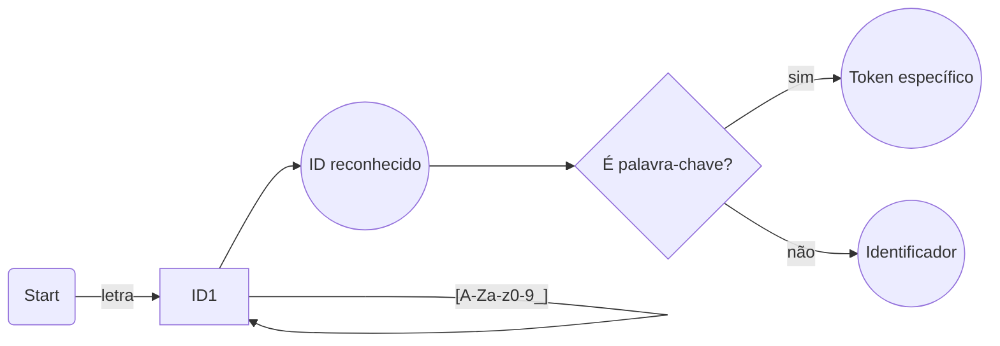
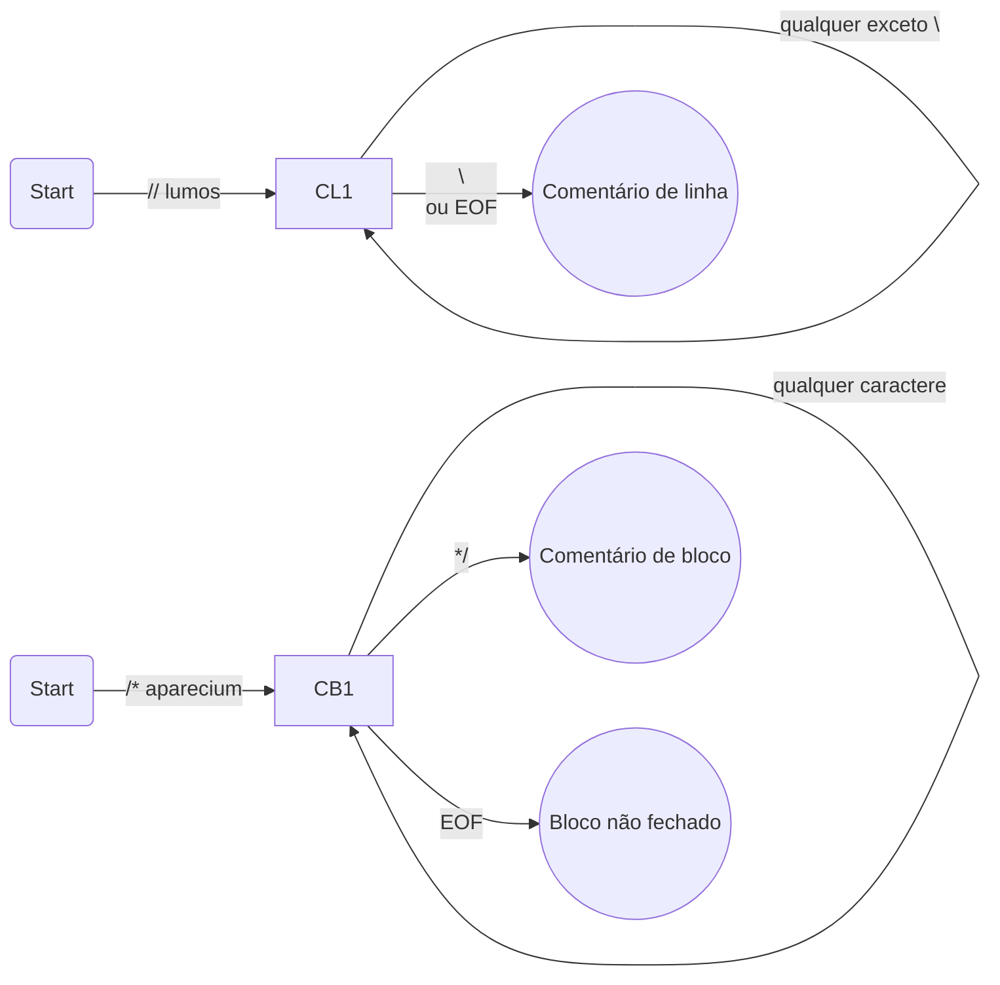
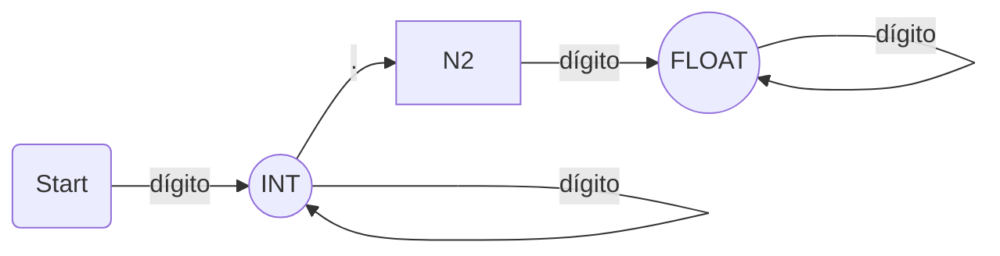
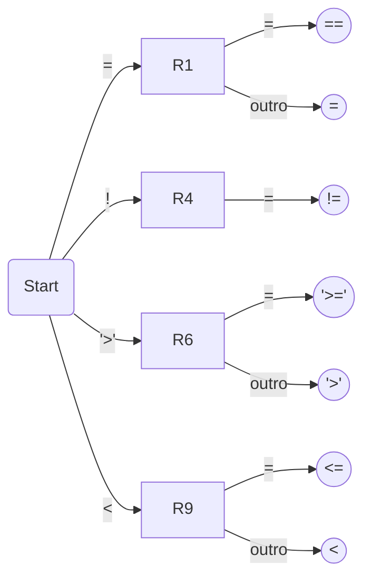
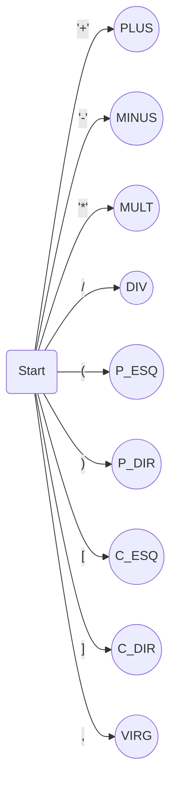
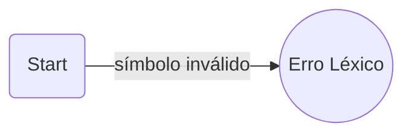

# Especificação Oficial da Linguagem HogwartsScript

## 1. Introdução

HogwartsScript é uma linguagem imperativa, ASCII-compatível e fortemente temática do universo Harry Potter, com tipagem estática, suporte a variáveis numéricas, vetores, funções, estruturas condicionais e laços de repetição.

## 2. Palavras da Linguagem

Descreve todas as palavras-chave reservadas da linguagem, divididas por categorias: declaração de variáveis, estruturas de controle, tipos de função, definição e chamada de funções, fechamento de blocos e comentários temáticos.

#### Diagrama de Identificadores + Keywords

Esse diagrama mostra que:

- Primeiro o token é reconhecido como ID
- Depois ocorre uma verificação para saber se é palavra-chave
### 2.1. Declaração de variáveis e vetores

Define as palavras-chave usadas para criar variáveis inteiras, flutuantes e vetores numéricos.

<table style="width: 100%;">
  <thead>
    <tr>
      <th>Palavra-chave</th>
      <th>Referência</th>
      <th>Descrição</th>
    </tr>
  </thead>
  <tbody>
    <tr>
      <td>gryffindor</td>
      <td>int</td>
      <td>Declara variável inteira</td>
    </tr>
    <tr>
      <td>ravenclaw</td>
      <td>float</td>
      <td>Declara variável float</td>
    </tr>
    <tr>
      <td>hufflepuff</td>
      <td>[ ]</td>
      <td>Declara vetor numérico</td>
    </tr>
  </tbody>
</table>

### 2.2. Estrutura de controle

Lista as palavras-chave utilizadas para condicionais (if, else) e laços (while), adaptadas ao tema Harry Potter.

<table style="width: 100%;">
  <thead>
    <tr>
      <th>Palavra-chave</th>
      <th>Referência</th>
      <th>Descrição</th>
    </tr>
  </thead>
  <tbody>
    <tr>
      <td>dumbledore</td>
      <td>if</td>
      <td>Criar bloco de condicional "se"</td>
    </tr>
    <tr>
      <td>severus</td>
      <td>else</td>
      <td>Criar bloco de condicional "senão"</td>
    </tr>
    <tr>
      <td>dobby</td>
      <td>while</td>
      <td>Criar bloco de repetição com condicional</td>
    </tr>
  </tbody>
</table>

### 2.3. Tipos de funções

Define as palavras-chave usadas para especificar o tipo de retorno de uma função: inteiro, flutuante ou sem retorno.

<table style="width: 100%;">
  <thead>
    <tr>
      <th>Palavra-chave</th>
      <th>Referência</th>
      <th>Descrição</th>
    </tr>
  </thead>
  <tbody>
    <tr>
      <td>gryffindor</td>
      <td>int</td>
      <td>Declara função de retorno inteiro</td>
    </tr>
    <tr>
      <td>ravenclaw</td>
      <td>float</td>
      <td>Declara função de retorno decimal</td>
    </tr>
    <tr>
      <td>slytherin</td>
      <td>void</td>
      <td>Declara função de retorno vazio</td>
    </tr>
  </tbody>
</table>

### 2.4. Funções

Explica os comandos para iniciar funções, retornar valores e chamar funções no código.

<table style="width: 100%;">
  <thead>
    <tr>
      <th>Palavra-chave</th>
      <th>Descrição</th>
    </tr>
  </thead>
  <tbody>
    <tr>
      <td>spell</td>
      <td>Início de uma função</td>
    </tr>
    <tr>
      <td>accio</td>
      <td>Comando de retorno</td>
    </tr>
    <tr>
      <td>cast</td>
      <td>Chamada de função</td>
    </tr>
    <tr>
      <td>avada</td>
      <td>Encerra blocos e funções</td>
    </tr>
  </tbody>
</table>

### 2.5. Comentários

Apresenta os formatos de comentário de linha e bloco com temática mágica.

#### Diagrama de Comentários


Esse comportamento reflete exatamente o analisador léxico:

- Comentários de linha vão até o fim da linha
- Comentários de bloco podem até não fechar 

Comentário de linha

```
// lumos isto é um comentário de linha
```

Comentário de bloco

```
/* aparecium
  comentário multilinha
*/
```

## 3. Tokens

Define os padrões básicos reconhecidos pelo analisador léxico: identificadores, números, operadores, comparações, atribuições, pontuações e comentários.

### 3.1. Identificadores

Regras formais para nomes de variáveis e funções.

```
[A-Za-z][A-Za-z0-9_]*
```

### 3.2. Números

#### Diagrama de Inteiros e Floats


Explicação:

- Um número começa como inteiro
- Ao encontrar ., passa a ser float
- Float só é válido se houver dígitos após o ponto

Definição léxica de inteiros e floats.

#### 3.2.1. Inteiros

```
[0-9]+
```

#### 3.2.2. Floats

```
[0-9]+\.[0-9]+
```

### 3.3. Operadores Aritméticos

Lista os operadores básicos suportados.

```
+   -   *   /
```

### 3.4. Comparação

Define operadores de comparação para condições.

```
==  !=  >  <  >=  <=
```

#### Diagrama de Comparação

Explicação:

- O analisador tenta formar operadores compostos primeiro (==, !=, etc.)
- Caso contrário, aceita a versão simples (=, <, >)
### 3.5. Atribuição

Define o token de atribuição.

```
=
```

### 3.6. Pontuação

Define parênteses, colchetes e vírgulas.

```
(   )   [   ]   ,
```
#### Diagrama de Símbolo Simples

### 3.7. Comentários

Formato léxico dos comentários temáticos de linha e bloco.

#### 3.7.1 Linha

```
"// lumos" .*   → ignorado
```

#### 3.7.2. Bloco

```
/\* aparecium(.|\n)*? \*/
```
#### 3.8 Estado de erro lógico

Caso nenhum dos padrões definidos anteriormente seja reconhecido, o analisador léxico entra em estado de erro.


Esse estado representa qualquer caractere ou sequência que não pertence à linguagem HogwartsScript.

## 4. Declaração de Variávies

Explica como declarar variáveis numéricas (int e float) e vetores utilizando as palavras-chave mágicas.

### 4.1. Variáveis simples

```
gryffindor idade = 17
ravenclaw energia = 3.14
```

### 4.2. Vetores

```
hufflepuff notas[5]
hufflepuff valores[10]
```

## 5. Expressões e Atribuições

Mostra como variáveis, operadores, números e funções podem compor expressões aritméticas válidas.

Expressões podem conter:

- números
- variáveis
- vetores
- operadores
- chamadas de função

Exemplos:

```
idade = idade + 1
energia = energia * 2.5
notas[3] = notas[1] + notas[2]
```

## 6. Estruturas de Controle

Mostra o funcionamento e sintaxe do if, else e while, incluindo exemplos básicos.

### 6.1. Condicional simples

```
dumbledore (idade > 17)
  idade = idade + 1
avada
```

### 6.2. Condicional composta

```
dumbledore (energia >= 5)
  energia = energia + 1
severus
  energia = energia - 1
avada
```

## 7. Laço de repetição

Descreve o uso do comando de repetição temático (dobby) com a condição usando operadores de comparação.

```
dobby (idade < 25)
  idade = idade + 1
avada
```

## 8. Funções

Explica como declarar funções com ou sem retorno, incluindo parâmetros tipados e uso do comando mágico de retorno.

###  8.1. Função que retorna inteiro

```
spell gryffindor somar(gryffindor a, gryffindor b)
  accio a + b
avada
```

###  8.2. Função que retorna float

```
spell ravenclaw elevar(ravenclaw x)
  accio x * x
avada
```

###  8.3. Função sem retorno

```
spell slytherin mostrar(gryffindor x)
  // lumos imprime valor
avada
```

## 9. Chamada de função

Mostra como invocar funções usando a palavra-chave temática (cast) e como armazenar seus resultados.

```
gryffindor r = cast somar(2, 3)
ravenclaw p = cast elevar(2.5)
cast mostrar(r)
```

## 10. Exemplo completo de programa

Traz um programa completo ilustrativo, integrando variáveis, vetores, funções, condicionais e laços.

```
/* aparecium
  Exemplo completo da linguagem HogwartsScript
*/

gryffindor idade = 17
ravenclaw energia = 4.5
patronus notas[5]

spell gryffindor somar(gryffindor a, gryffindor b)
  accio a + b
fim

spell slytherin registrar(ravenclaw v)
  energia = energia + v
fim

idade = cast somar(idade, 1)
cast registrar(2.0)

dumbledore (idade > 18)
  energia = energia * 2
severus
  energia = energia / 2
avada

dobby (idade < 25)
  idade = idade + 1
avada
```
